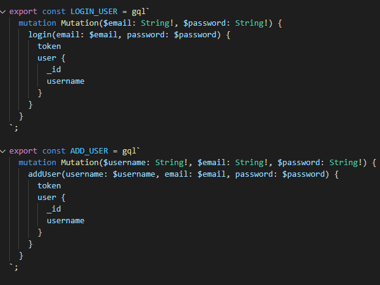
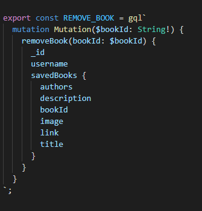
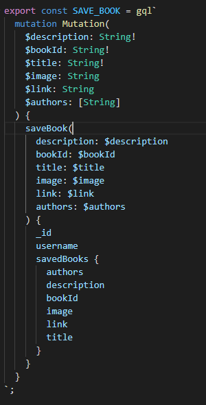
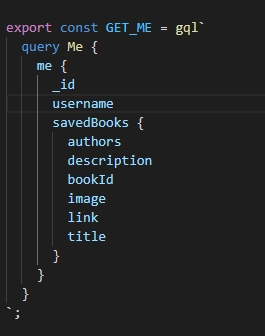

# 21 MERN Rest to GraphQL Conversion

Converting a working Rest API to GraphQL API with Jason Web token auth.

## Website

[Website](https://mern-rest-to-graphql-c6ff836a372f.herokuapp.com/)

## User Story

```md
AS AN avid reader
I WANT to search for new books to read
SO THAT I can keep a list of books to purchase
```

## Acceptance Criteria

```md
GIVEN a book search engine
WHEN I load the search engine
THEN I am presented with a menu with the options Search for Books and Login/Signup and an input field to search for books and a submit button
WHEN I click on the Search for Books menu option
THEN I am presented with an input field to search for books and a submit button
WHEN I am not logged in and enter a search term in the input field and click the submit button
THEN I am presented with several search results, each featuring a book’s title, author, description, image, and a link to that book on the Google Books site
WHEN I click on the Login/Signup menu option
THEN a modal appears on the screen with a toggle between the option to log in or sign up
WHEN the toggle is set to Signup
THEN I am presented with three inputs for a username, an email address, and a password, and a signup button
WHEN the toggle is set to Login
THEN I am presented with two inputs for an email address and a password and login button
WHEN I enter a valid email address and create a password and click on the signup button
THEN my user account is created and I am logged in to the site
WHEN I enter my account’s email address and password and click on the login button
THEN I the modal closes and I am logged in to the site
WHEN I am logged in to the site
THEN the menu options change to Search for Books, an option to see my saved books, and Logout
WHEN I am logged in and enter a search term in the input field and click the submit button
THEN I am presented with several search results, each featuring a book’s title, author, description, image, and a link to that book on the Google Books site and a button to save a book to my account
WHEN I click on the Save button on a book
THEN that book’s information is saved to my account
WHEN I click on the option to see my saved books
THEN I am presented with all of the books I have saved to my account, each featuring the book’s title, author, description, image, and a link to that book on the Google Books site and a button to remove a book from my account
WHEN I click on the Remove button on a book
THEN that book is deleted from my saved books list
WHEN I click on the Logout button
THEN I am logged out of the site and presented with a menu with the options Search for Books and Login/Signup and an input field to search for books and a submit button
```

## Description

This is a book saving website where a user can create an account and then search from books using the Google books API. Once they have found a book, they able to save that book to there account. Once on there account they can see the saved books and delete the books they don't want anymore.

I had to convert the Rest API that was sitting behind this project to work with GraphQL and Apollo. GraphQL is a lot different from how Rest API works but once set up, its easy to use on the frontend which makes it a lot better and more versatile as you can change the query to what you want on the frontend, without having to set up another route, unlike Rest.

## Usage

This a pre done project, so I will only show the queries and give a description about how it works

### Login and Signup Methods

Once I had the resolver and Typedefs setup to expect login methods then I could use these mutations on the frontend to create and login a user



## Save and delete methods

All you had to do is setup a typedef and resolver that expected to delete and save the books and using Apollo Client you can send your variables to the backend easily.





## Get me

This gets the current user logged in via the context that is sent into the resolver. This is used to show all the saved books on the user.


